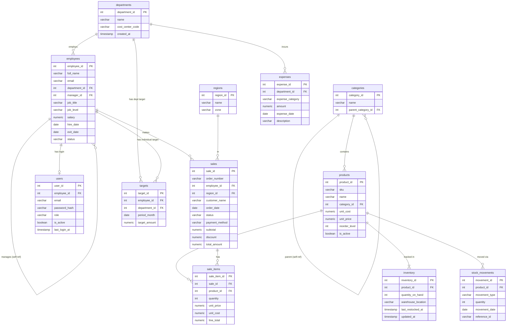

# Entity-Relationship Diagram

> Generated from SQLAlchemy models in `backend/app/models/`.  
> Rendered with [Mermaid](https://mermaid.js.org/) — paste into any Mermaid-compatible viewer.

## Design notes

- **`employees.manager_id`** self-references the same table — the recursive CTE in `workforce/hierarchy.sql` walks this column to produce the full org tree at any depth.
- **`targets`** supports both individual targets (`employee_id` set) and department-level targets (`department_id` set). Either FK may be NULL; a CHECK constraint enforces that exactly one is populated.
- **`sale_items`** is the fact table. Profit is always derived (`(unit_price - unit_cost) × quantity`) — never stored — so it can never drift from source.
- **`users`** is decoupled from `employees`: a user can exist without an employee record (service accounts), and an employee can exist without a login.
- **Views**: `vw_monthly_revenue`, `vw_employee_performance`, `vw_inventory_health` encapsulate common aggregations; `mvw_daily_sales_summary` (materialized) powers the executive overview with a single fast scan.
